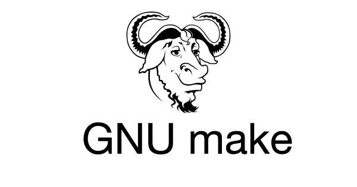
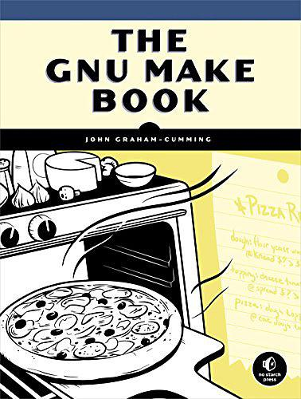
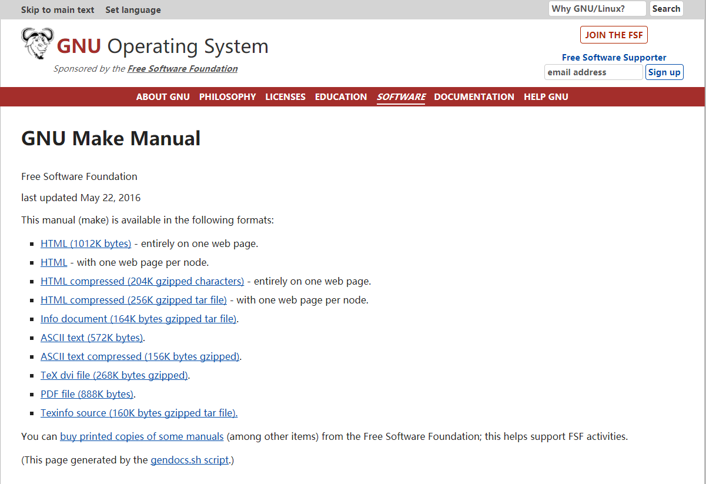
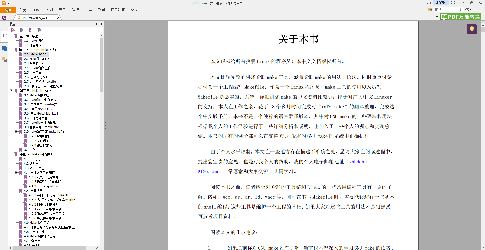

# GNU make学习笔记



## 本仓库内容

1. GNU make学习笔记

```
Something I hope you know before go into the coding~
First, please watch or star this repo, I'll be more happy if you follow me.
Bug report, questions and discussion are welcome, you can post an issue or pull a request.
```

## 相关站点

* GitHub地址:<https://github.com/yifengyou/learn-make>
* GitBook地址:<https://yifengyou.gitbooks.io/learn-make/content/>
* GitPage : <https://yifengyou.github.io/learn-make/>


## GNU make简介

一个工程中的源文件不计其数，其按类型、功能、模块分别放在若干个目录中，makefile定义了一系列的规则来指定，哪些文件需要先编译，哪些文件需要后编译，哪些文件需要重新编译，甚至于进行更复杂的功能操作，因为**makefile就像一个Shell脚本一样，其中也可以执行操作系统的命令。**

Linux 环境下的程序员如果不会使用GNU make来构建和管理自己的工程，应该不能算是一个合格的专业程序员，至少不能称得上是 Unix程序员。在 Linux（unix ）环境下使用GNU 的make工具能够比较容易的构建一个属于你自己的工程，整个工程的编译只需要一个命令就可以完成编译、连接以至于最后的执行。不过这需要我们投入一些时间去完成一个或者多个称之为Makefile 文件的编写。

所要完成的 **Makefile 文件描述了整个工程的编译、连接等规则**。其中包括：工程中的哪些源文件需要编译以及如何编译、需要创建哪些库文件以及如何创建这些库文件、如何最后产生我们想要的可执行文件。尽管看起来可能是很复杂的事情，但是为工程编写Makefile 的好处是能够使用一行命令来完成“自动化编译”，一旦提供一个（通常对于一个工程来说会是多个）正确的 Makefile。编译整个工程你所要做的唯一的一件事就是在shell 提示符下输入make命令。整个工程完全自动编译，极大提高了效率。

**make是一个命令工具，它解释Makefile 中的指令（应该说是规则）**。在Makefile文件中描述了整个工程所有文件的编译顺序、编译规则。Makefile 有自己的书写格式、关键字、函数。像C 语言有自己的格式、关键字和函数一样。而且在Makefile 中可以使用系统shell所提供的任何命令来完成想要的工作。Makefile（在其它的系统上可能是另外的文件名）在绝大多数的IDE 开发环境中都在使用，已经成为一种工程的编译方法。

**make命令本质就是Makefile脚本解释器的角色**

## 目录

* [GNU make](README.md)
* [概述](docs/概述/概述)
  - [Make之前基本知识](docs/概述/Make之前基本知识)
  - [GNU make介绍](docs/概述/GNU-make介绍)
* [Makefile总述](docs/Makefile总述/Makefile总述)
* [规则的命令](docs/规则的命令/第四章-规则的命令)
* [Makefile中的变量](docs/Makefile中的变量/Makefile中的变量)
* [Makefile的条件执行](docs/Makefile的条件执行/Makefile的条件执行)
* [make的内嵌函数](docs/make的内嵌函数/make的内嵌函数)
* [执行make](docs/执行make/执行make)
* [make的隐含规则](docs/make的隐含规则/make的隐含规则)
* [使用make更新静态库文件](docs/使用make更新静态库文件/使用make更新静态库文件)
* [GNU make的特点](docs/GNU make的特点/GNU make的特点)
* [和其它版本的兼容](docs/和其它版本的兼容/和其它版本的兼容)
* [Makefile的约定](docs/Makefile的约定/Makefile的约定)
* [make的常见错误信息](docs/make的常见错误信息/make的常见错误信息)


## 思维导图


## 参考教程





<http://www.gnu.org/software/make/manual/>



* <https://www.cnblogs.com/yyangblog/p/4159778.html>
* <https://blog.csdn.net/hawks93/article/details/79444229>
